# Cadle

**A Destiny-grade FPS-RPG that runs in a browser tab.** Ten regions, sixty-five quests, twenty-five
creatures, no download and no account. Everything you hear is synthesised in code.

### ▶ [Play it now — cadle.gg](https://cadle.gg/play/?start)


[](https://github.com/Humpalumps/Cadle/actions/workflows/checks.yml)
[](LICENSE)
[](https://threejs.org)

Cadle aims at one target: **Destiny 2's moment-to-moment feel** with **Final Fantasy XIV's light**.
90–105° FOV, sprint-slide-double-jump with real momentum, per-archetype recoil and ADS snap, hit
markers and damage numbers — over a 2 km² world of ten biomes you walk between, each with its own
ground, silhouette, bestiary, weather of light and score. It runs at 124 fps on a desktop GPU.

---

## Walk into any region right now

No install, no account. Each link drops you at that region's landmark, facing it, with the music and
the light already correct — `?at=<id>` is a supported parameter, not a debug hack.

| | |
|---|---|
| [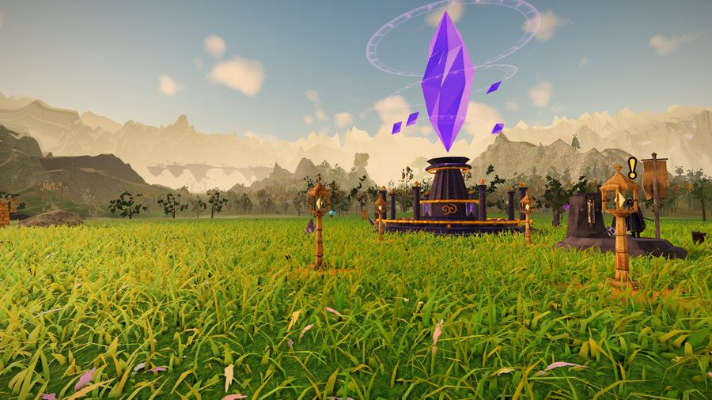](https://cadle.gg/play/?start&at=vale)<br>**[The Vale](https://cadle.gg/play/?start&at=vale)** · levels 1–10<br><sub>Meadow, lake and ruins. Where you start.</sub> | [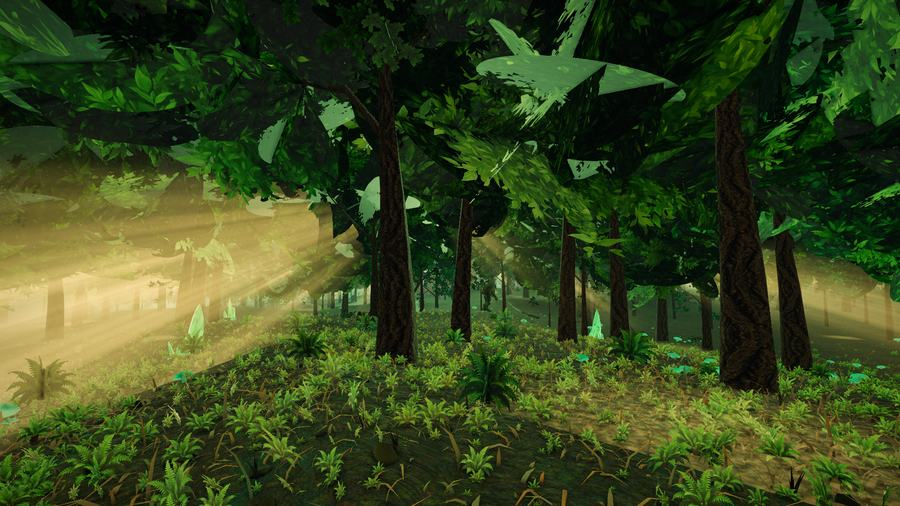](https://cadle.gg/play/?start&at=forest)<br>**[Whisperwood Deep](https://cadle.gg/play/?start&at=forest)** · levels 5–11<br><sub>Closed canopy, fae light, The Elderheart.</sub> |
| [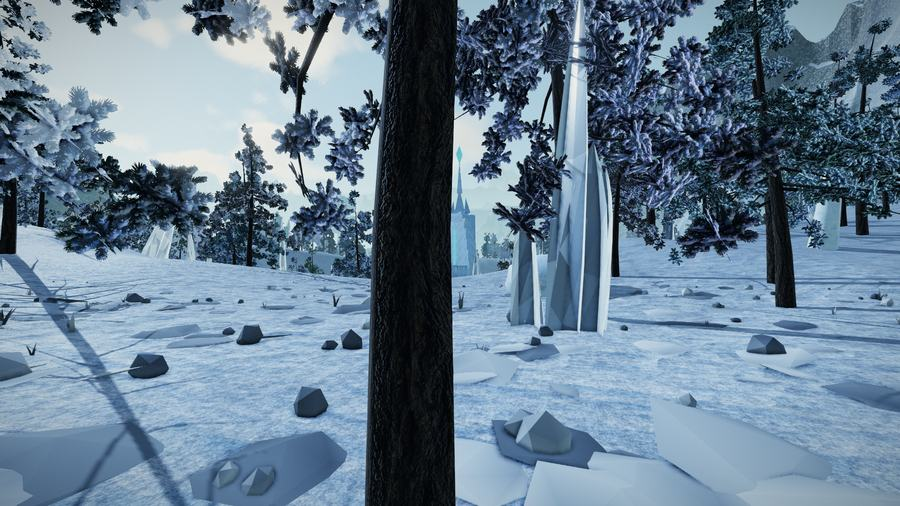](https://cadle.gg/play/?start&at=tundra)<br>**[Frostveil Tundra](https://cadle.gg/play/?start&at=tundra)** · levels 11–17<br><sub>Glacier shelves, pines, ice shards.</sub> | [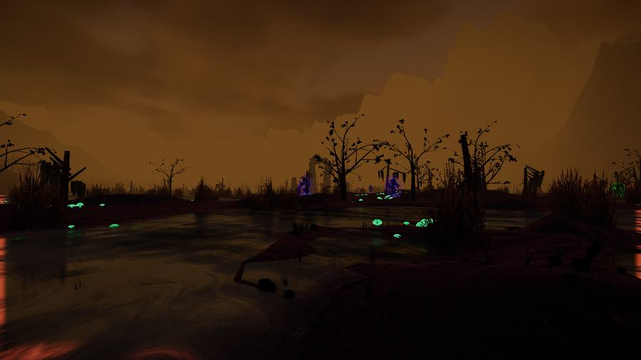](https://cadle.gg/play/?start&at=shadowfen)<br>**[Shadowfen](https://cadle.gg/play/?start&at=shadowfen)** · levels 15–22<br><sub>Knee-deep peat murk and dead wood.</sub> |
| [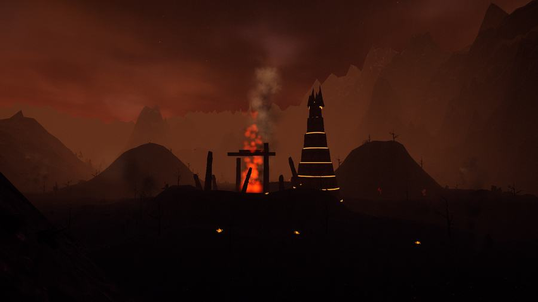](https://cadle.gg/play/?start&at=infernal)<br>**[Infernal Wastes](https://cadle.gg/play/?start&at=infernal)** · levels 18–25<br><sub>A caldera with lava rivers, still burning.</sub> | [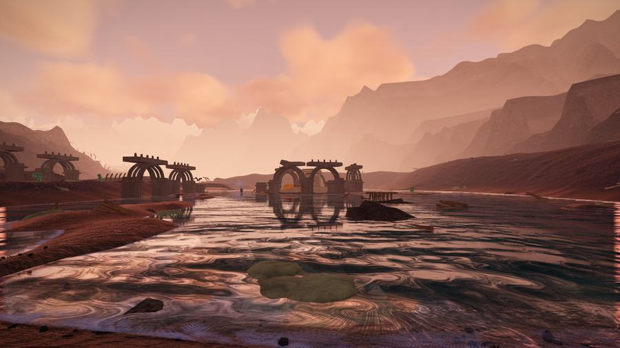](https://cadle.gg/play/?start&at=sunken)<br>**[The Sunken Kingdom](https://cadle.gg/play/?start&at=sunken)** · levels 20–28<br><sub>Waterfalls, rapids, a drowned court.</sub> |
| [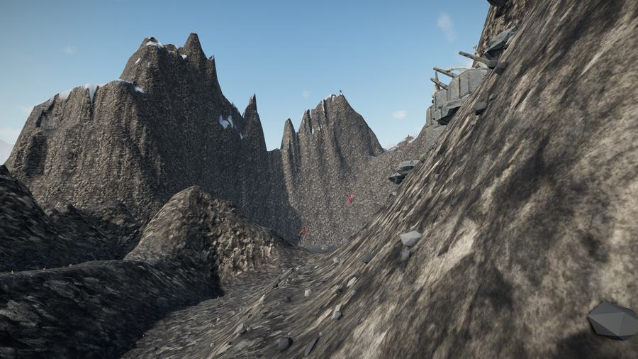](https://cadle.gg/play/?start&at=dragon)<br>**[Dragon Peaks](https://cadle.gg/play/?start&at=dragon)** · levels 24–32<br><sub>200 m peaks and nest ledges.</sub> | [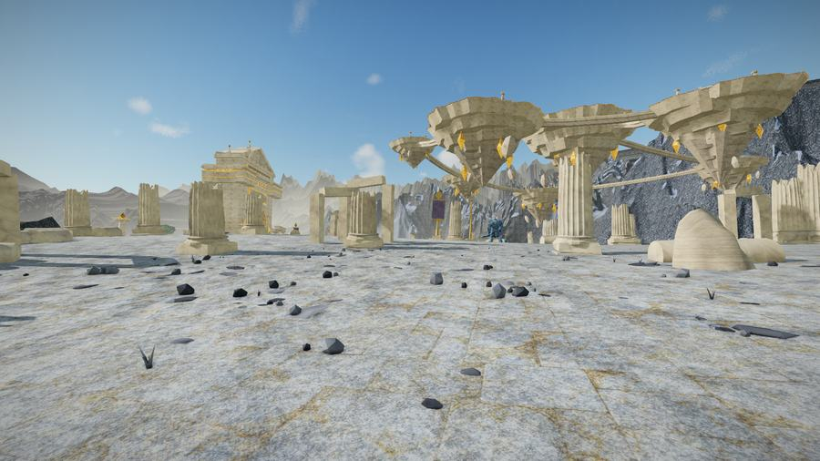](https://cadle.gg/play/?start&at=celestial)<br>**[Celestial Isles](https://cadle.gg/play/?start&at=celestial)** · levels 30–38<br><sub>Marble plateau and floating isles.</sub> |
| [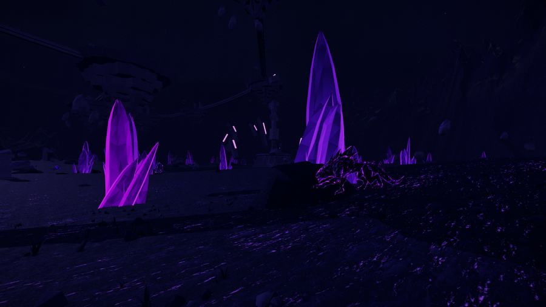](https://cadle.gg/play/?start&at=void)<br>**[The Void](https://cadle.gg/play/?start&at=void)** · levels 34–44<br><sub>Shelves over an abyss. Gravity is 0.55.</sub> | [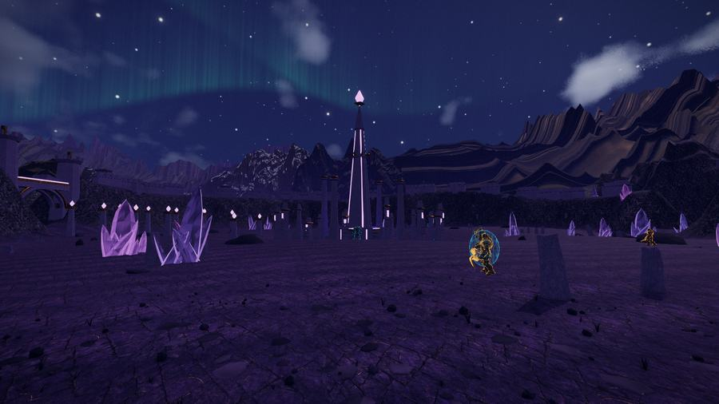](https://cadle.gg/play/?start&at=lost)<br>**[The Lost Realm](https://cadle.gg/play/?start&at=lost)** · levels 40–50<br><sub>Endgame: rampart ring, sixteen monoliths.</sub> |

Every region touches its two neighbours and has its own pass home through the mountain ring. Nothing
is teleport-only — if you can see it you can walk to it, and the walk is most of the point.

---

## What is actually in here

**The world.** 2048 × 2048 m, one continuous heightfield, ten biomes. A mountain ring rises to ~150 m
around the home bowl and is pierced by nine passes, one per outer region. Floating isles you can stand
on, updraft columns that lift you, lava, water with real reflection and refraction, 0.55 g in the Void.
Biome ownership is a partition, so a border is a line you cross rather than a corridor of nobody's-land.

**Combat.** Eight weapon archetypes — hand cannon, auto rifle, pulse, scout, shotgun, sniper, fusion,
beam — each with its own recoil pattern, ADS snap and reason to exist. Four abilities on cooldown
(grenade, melee, class, super). Hit markers, damage numbers, stagger and death reactions.

**RPG.** 65 quests across the ten regions (15 in the Vale alone), levels 1–50, a five-tier loot table
(common → exotic) with published drop rates and real pity timers — hard pity at 20 / 90 / 400 drops.
Quest content is **data**, not code: adding a quest never means writing a function, and CI asserts that
every enemy and item a quest names actually exists.

**Creatures.** 25 types, from wisps to the Archon — rigged GLBs with a LOD ladder, up to 72 alive.
Camps stream by distance (300 m), so the population follows you around the map instead of being spent
at spawn, and the starting meadow stays peaceful on purpose.

**Graphics.** Cascaded shadow maps, ACES tone mapping, TAA, volumetric-looking clouds and god rays,
long view distances with atmospheric haze, instanced grass that reacts to wind and to you, painterly
materials tuned per biome, and a magical blue-violet night on a full day cycle.

**Audio.** Fully synthesised — every gunshot, impact, explosion and the score itself is generated by
`src/audio/`, not sampled. See [NOTICE](NOTICE) for why there are no recorded takes in this repository.

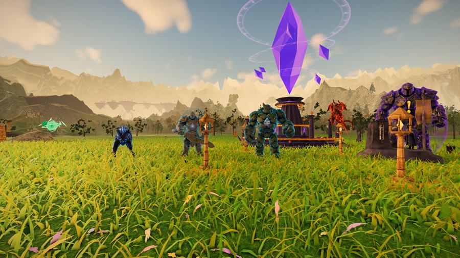

---

## Performance

Measured on an RTX 3060 at 1920×1080, `q=high`, vsync off — so frame ms is real cost, not a wait:

| | measured | budget |
|---|---|---|
| frame mean | **8.0 ms** (124 fps) | ≤ 7 ms |
| p99 | **12.8 ms** | ≤ 14 ms |
| draw calls | **235** | ≤ 350 |
| triangles | **2.96 M** | ≤ 4 M |
| memory over 30 s | flat at 468 MB | no growth |

The live site holds 107 fps under the same harness. `q=low` targets ≤ 4 ms for laptops. Hitches count
as failures: `tools/hitchhunt.mjs` records every frame and blames each spike on the system that was
slow on it, because percentiles hide a single 1 s stall.

---

## Run it locally

```bash
npm install
npm run dev
```

- `http://127.0.0.1:5173/` — the marketing site
- `http://127.0.0.1:5173/play/` — the game

Node 22, a WebGL2 browser, Chromium recommended. **Nothing loads until you press Play**: landing on
`/play/` builds no renderer, no world and no asset preload — the title screen is idle until you ask.

### URL parameters

| parameter | what it does |
|---|---|
| `?at=<id>` | spawn in a region: `vale`, `forest`, `tundra`, `shadowfen`, `infernal`, `sunken`, `dragon`, `celestial`, `void`, `lost` |
| `&back=N` | metres short of that region's landmark (default 150) |
| `&start` | skip the title screen, go straight to loading |
| `&q=` | quality preset: `low`, `medium`, `high`, `ultra` |
| `&hour=H` | set and freeze the time of day |
| `&seed=N` | world seed (default 1337) |
| `&debug=1` | debug overlays |
| `&auto=1` | automation mode: no click-to-start, synthetic input |

Play on a desktop — it is a mouse-and-keyboard shooter with no touch controls, and `/play/` says so on
a phone rather than loading an engine you cannot drive.

---

## How it is built

Plain ES modules. No TypeScript, no framework, no state library. Vite for the dev server and the build;
three.js r185 and `postprocessing` are the only runtime dependencies.

```
src/core/       game loop, fixed update order, input, asset preload
src/render/     renderer, sky and time of day, lighting + CSM, post-processing
src/world/      terrain (worker-baked heightfield), biomes, water, grass, vegetation, landmarks
src/player/     movement physics, camera feel, weapons and viewmodels, abilities
src/enemies/    creatures, AI, spawner, streaming        src/combat/  hit resolution, projectiles
src/rpg/        quests (data), progression, loot, shop   src/vfx/     particles, tracers, decals
src/audio/      synthesis: weapons, ambience, score      src/ui/      HUD, menus, title screen
src/site/       cadle.gg — no engine, no three
tools/          the harness: headless capture, regression gates, perf probes
```

Every file's header comment is that system's contract. [`CLAUDE.md`](CLAUDE.md) holds the architecture
rules, the performance budget and the world layout.

## Checks

```bash
node tools/invariants.mjs   # source guardrails: the bugs that keep coming back (also CI)
node tools/check.mjs        # every module parses and its imports resolve (also CI)
node tools/curvecheck.mjs   # xp curve closes, quest content exists, drop rates and pity hold (also CI)
node tools/buildcheck.mjs   # the production build still ships a real entry on both pages (also CI)
node tools/gate.mjs         # visual regression: bloom blobs, jitter, pointer lock — needs a GPU
node tools/animcheck.mjs    # creatures actually animate: no T-pose, foot slide or moonwalk
node tools/hitchhunt.mjs    # per-frame spike hunting, blamed on the system responsible
node tools/inspect.mjs      # drive the running game headless and screenshot it
```

Each invariant encodes a bug that shipped more than once — that is the bar for adding one.

## Licence

Code is MIT — see [LICENSE](LICENSE). The asset files under `public/assets/` are **not** covered by
that grant, and the recorded audio is not in this repository at all; [NOTICE](NOTICE) explains both,
and the game synthesises everything it needs without them.
